# ifthenpay | Payments for SureCart

Adds ifthenpay payment methods to SureCart: Multibanco reference, MB WAY, and ifthenpay Gateway (cards, Apple Pay, Google Pay).

---

## Table of Contents

- [Description](#description)
- [Key Features](#key-features)
- [Requirements](#requirements)
- [Installation](#installation)
- [Screenshots](#screenshots)
- [Frequently Asked Questions](#frequently-asked-questions)
- [External Services](#external-services)
- [Support](#support)

## Description

This plugin adds three ifthenpay payment methods to SureCart checkout, each provisioned automatically as a SureCart Manual Payment Method the moment the plugin is activated: **Multibanco**, **MB WAY**, and **ifthenpay Gateway** (cards, Apple Pay, Google Pay, and any other method provisioned on your Gateway Key).

A single ifthenpay **Backoffice Key** connects everything — Multibanco and MB WAY are picked as named accounts already provisioned on it, and ifthenpay Gateway additionally uses a Gateway Key (and its enabled methods) chosen from that same Backoffice Key. There are no separate keys to hunt down.

Payment is triggered the instant the customer clicks Purchase, via a checkout-time modal that calls ifthenpay directly — with a confirmation-page fallback for stores where that isn't available. Because Multibanco and MB WAY are paid asynchronously (sometimes hours after checkout), the order stays "awaiting payment" until ifthenpay's server-to-server callback confirms it, at which point the plugin marks the SureCart checkout paid automatically — no manual action required.

### In plain terms you get:

* Three ifthenpay payment methods, auto-provisioned in SureCart on activation
* One Backoffice Key powers all of them — no separate keys to collect
* Automatic, webhook-driven payment confirmation
* A live payment-status block on the customer's own order page
* No card numbers stored on your website

All settings are configured directly in this plugin's own settings screen (under SureCart's admin menu) and your ifthenpay Backoffice. The plugin is designed so site owners can manage payments without requiring deep technical knowledge.

## Key Features

1. Three ifthenpay payment methods — Multibanco, MB WAY, and ifthenpay Gateway (cards, Apple Pay, Google Pay, and other methods provisioned on your Gateway Key) — auto-provisioned as SureCart Manual Payment Methods on activation.
2. One Backoffice Key connects everything: pick named accounts for Multibanco/MB WAY, and a Gateway Key + methods for ifthenpay Gateway.
3. Checkout-time payment modal — calls ifthenpay the instant "Purchase" is clicked, with a confirmation-page fallback for stores that don't use the modal path.
4. Automatic payment confirmation via secure server-to-server callbacks that mark the SureCart order paid; MB WAY payments are additionally re-checked actively, so a slow or missing callback doesn't leave the customer stuck waiting.
5. An "ifthenpay Payment Details" block for SureCart's customer-dashboard order page — shows the customer their payment method and status, plus (while still pending) the Multibanco entity/reference or MB WAY confirmation status.
6. Real ifthenpay brand icons for each payment method, fetched from ifthenpay's own method catalog once your Backoffice Key is connected.
7. Subscriptions are intentionally excluded: ifthenpay has no auto-renewal API, so these three methods are automatically hidden at checkout for any cart containing a recurring/subscription price — customers are never offered a payment method that can't actually renew.
8. An admin "ifthenpay Orders" log of every Multibanco/MB WAY/ifthenpay Gateway payment attempt (method, amount, state), linking straight to the resulting SureCart order once paid.

## Requirements

* An active ifthenpay merchant account with a Backoffice Key — [subscribe here](https://ifthenpay.com/aderir/) to obtain your credentials.
* Multibanco/MB WAY/card-and-wallet accounts provisioned on that Backoffice Key (ifthenpay's helpdesk can guide you).
* SureCart installed, active, and connected (its own API token configured) — this plugin creates its Manual Payment Methods through SureCart's API.
* WordPress 6.5+ (tested up to 6.9), PHP 7.4+.
* HTTPS (SSL) enabled on your site, so ifthenpay's callbacks can reach it.

## Installation

1. **Install SureCart:** install and activate SureCart, and connect your store (its own Settings → API) if you haven't already.
2. **Install this plugin:** on activation, it creates three Manual Payment Methods in SureCart — Multibanco, MB WAY, and ifthenpay Gateway — automatically. If SureCart's API token isn't configured yet, this step is deferred and retried until it succeeds.
3. **Open the settings screen:** go to `SureCart → ifthenpay` in the WordPress admin (also linked from a row on SureCart's own `Settings → Processors` tab).
4. **Connect your Backoffice Key:** this single key powers every method below it.
5. **Multibanco / MB WAY:** on each tab, pick which of your ifthenpay Backoffice's named accounts to use — there's nothing to type, just a dropdown (or a one-line confirmation if you only have one account).
6. **ifthenpay Gateway:** pick a Gateway Key, then enable whichever card/wallet methods (Card, Apple Pay, Google Pay, etc.) are provisioned on it.
7. **Activate:** on the Settings tab, turn on each method you've connected — a method can only be activated once it's connected on its own tab.
8. **Test:** make a low-value purchase for each method you enabled and confirm the order is marked Paid once ifthenpay's callback arrives.

## Frequently Asked Questions

<strong>Does this plugin require SureCart?</strong>

Yes. SureCart must be installed and active to use this plugin.

Without SureCart, the plugin has no forms to attach payments to and will show an admin notice.

<strong>Do I need a separate key for each payment method?</strong>

No. A single ifthenpay Backoffice Key connects all three methods — Multibanco and MB WAY are picked as named accounts already provisioned on it, and ifthenpay Gateway additionally uses a Gateway Key chosen from that same Backoffice Key.

<strong>Why don't I see ifthenpay at checkout for a subscription product?</strong>

ifthenpay has no native way to automatically charge a stored payment method for future renewals, so this plugin intentionally hides its payment methods on any checkout containing a recurring price. Use Stripe, PayPal, or another SureCart-native recurring processor for subscriptions.

<strong>Does this plugin store card numbers?</strong>

No. Card payments go through ifthenpay's own hosted ifthenpay Gateway page; this plugin never sees or stores card data.

<strong>Which payment methods are supported?</strong>

Any ifthenpay method attached to your Gateway Key, including:

Ifthenpay Gateway (Pay By Link):
* Multibanco
* MB WAY
* Payshop
* Credit Card
* Google Pay
* Apple Pay
* Pix

Separated Single methods:
* MBWAY
* Multibanco

<strong>What confirms a Multibanco or MB WAY payment?</strong>

ifthenpay calls a webhook registered against your Backoffice Key's accounts once the payment is received. The plugin validates that callback and marks the SureCart checkout paid — no polling from the customer's side is required, though MB WAY is additionally re-checked directly so a slow or missing webhook doesn't leave the customer stuck on a "waiting" screen.

<strong>Where can the customer see their payment status?</strong>

On their own SureCart order page (`customer-dashboard → Orders → an order`), via the "ifthenpay Payment Details" block — it shows the method used, its icon, and whether it's still pending, paid, or didn't complete.

## External Services

This plugin integrates with the ifthenpay payment platform to process payments for SureCart submissions. ifthenpay is a third-party service that provides secure payment processing for cards, wallets, and local bank transfers.

- **[SureCart](https://surecart.com)**
  - **What it is and what it is used for**: SureCart is the e-commerce checkout and order-management platform this plugin is built for. It provides the checkout flow, order records, and the Manual Payment Method framework that this plugin registers Multibanco, MB WAY, and ifthenpay Gateway into. The plugin reads SureCart order/checkout data to build ifthenpay payment requests, then writes the payment result back to the SureCart order once ifthenpay confirms it.

- **ifthenpay Backoffice & Integrations**
  - **What it is and what it is used for**: The ifthenpay Backoffice is the merchant dashboard used to manage integrations and payment configurations. The plugin uses the ifthenpay API to generate payment links and validate transactions.
  - **What data is sent and when**:
    - During setup: Backoffice Key and Gateway Key for authentication and configuration retrieval.
    - During payment processing: Transaction ID, amount, description, enabled payment method accounts, success/error/cancel return URLs, language, and optionally the selected payment method, customer email, customer name, and form field data.
    - During callbacks: Payment status, Transaction ID, and payment method (received from ifthenpay).
  - **Network & VPN Requirements**: Outbound HTTPS requests are made to ifthenpay APIs for setup, link generation, and status validation. Servers behind strict firewalls or restrictive outbound VPNs must allowlist the following domains to prevent connection timeouts:
    - [api.ifthenpay.com](https://api.ifthenpay.com)
    - [ifthenpay.com](https://ifthenpay.com)

  - **End-User License Agreement (EULA)**: [EULA](https://ifthenpay.com/eula/)
  - **Privacy Policy**: [Privacy Policy](https://ifthenpay.com/politica-de-privacidade/)

All network requests are performed server-side over HTTPS. Sensitive credentials are stored securely and are not publicly exposed. No raw card or bank details are stored.

## Screenshots

Below are screenshots demonstrating key features and interfaces of the plugin:

1.  **(Admin Only) Connect ifthenpay Account (SureCart → ifthenpay)**
    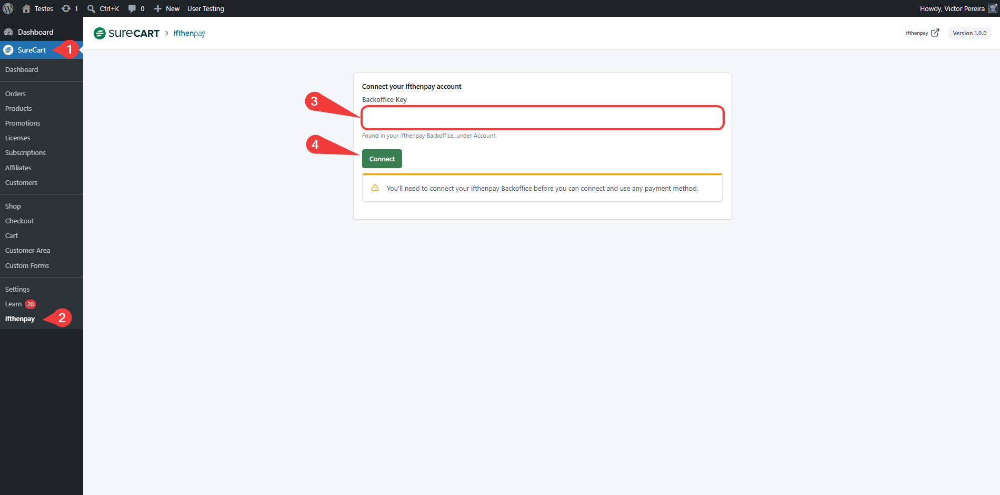
2.  **(Admin Only) Settings tab — Backoffice Key connected, payment methods list**
    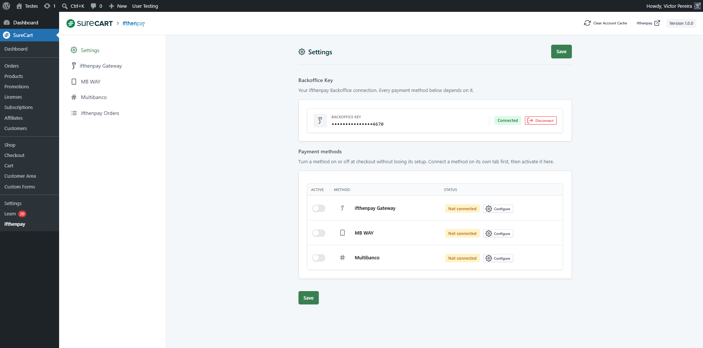
3.  **(Admin Only) ifthenpay Gateway tab — Gateway Key selector and payment-methods table**
    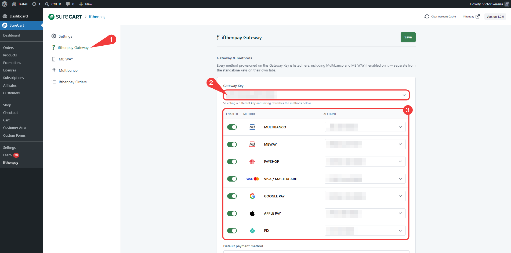
4.  **(Admin Only) ifthenpay Gateway tab — default payment method and hosted-page settings**
    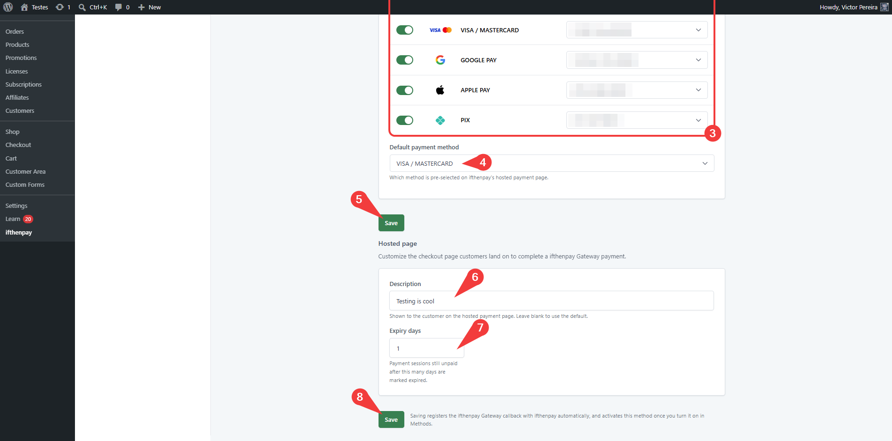
5.  **(Admin Only) MB WAY tab — account selection**
    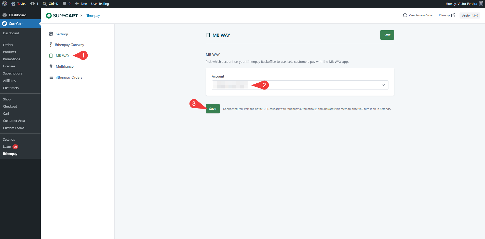
6.  **(Admin Only) Multibanco tab — account selection and expiry days**
    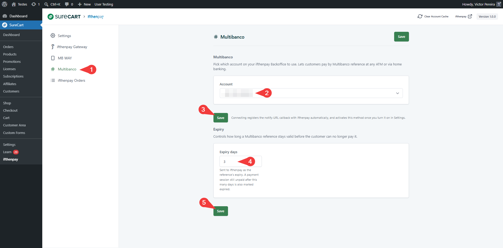
7.  **(Admin Only) Settings tab — activating connected payment methods**
    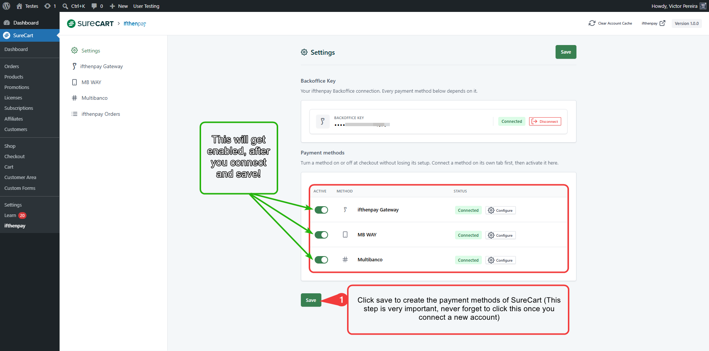
8.  **(Admin Only) SureCart → Settings → Payment Processors — Manual Payment Methods created automatically**
    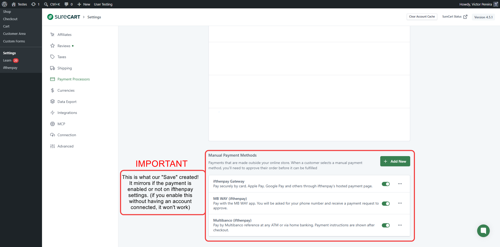
9.  **(Admin Only) SureCart Dashboard — revenue and orders overview**
    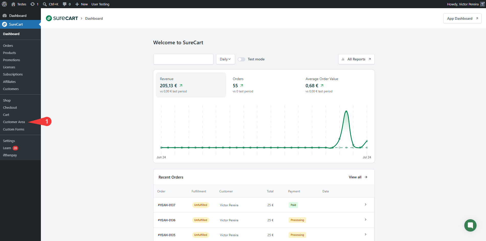
10. **(Admin Only) Customer Dashboard editor — adding the "ifthenpay Payment Details" block**
    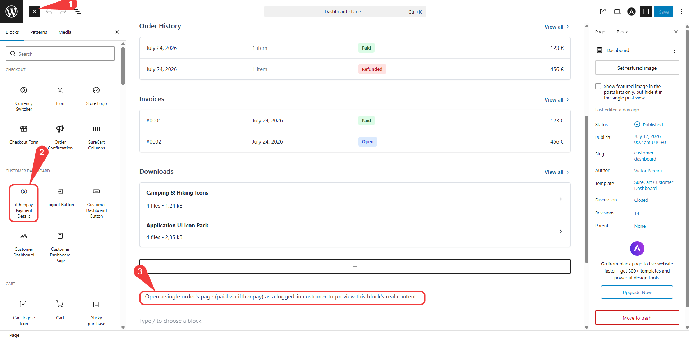
11. **(Customers Experience) Checkout — ifthenpay payment options**
    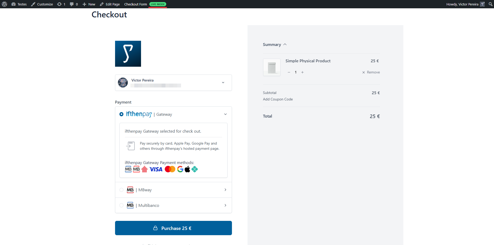
12. **(Customers Experience) Payment Window — choose how to pay**
    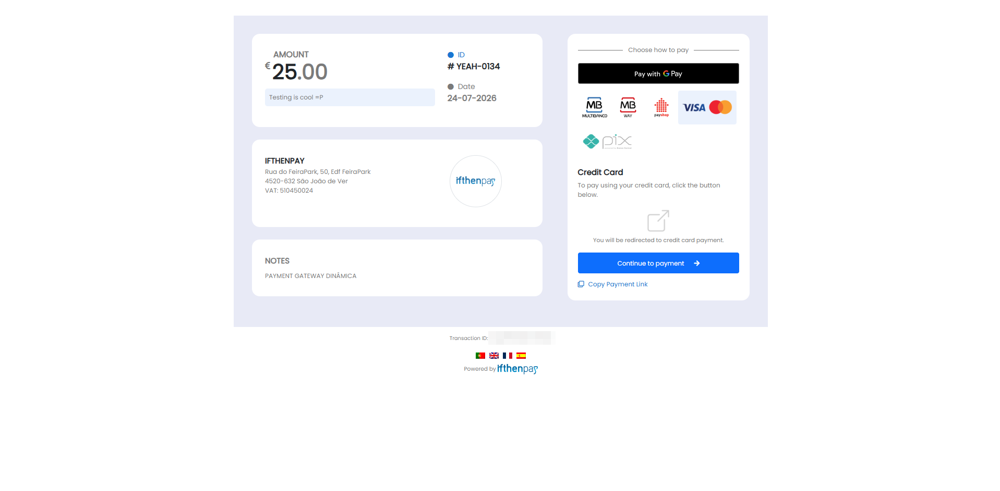
13. **(Customers Experience) MB WAY — enter phone number**
    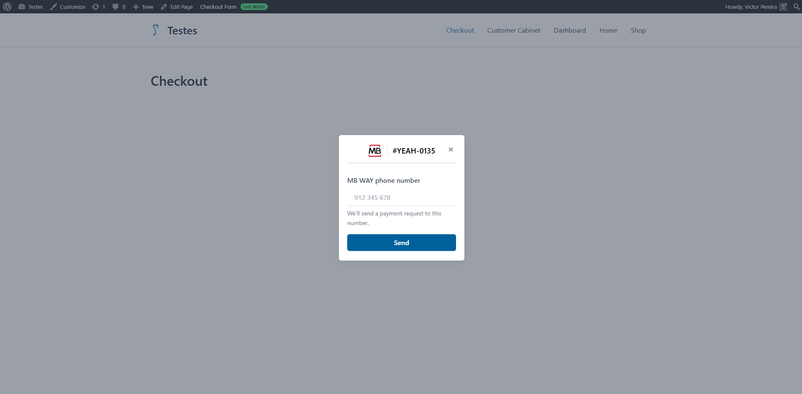
14. **(Customers Experience) MB WAY — approve payment on your phone**
    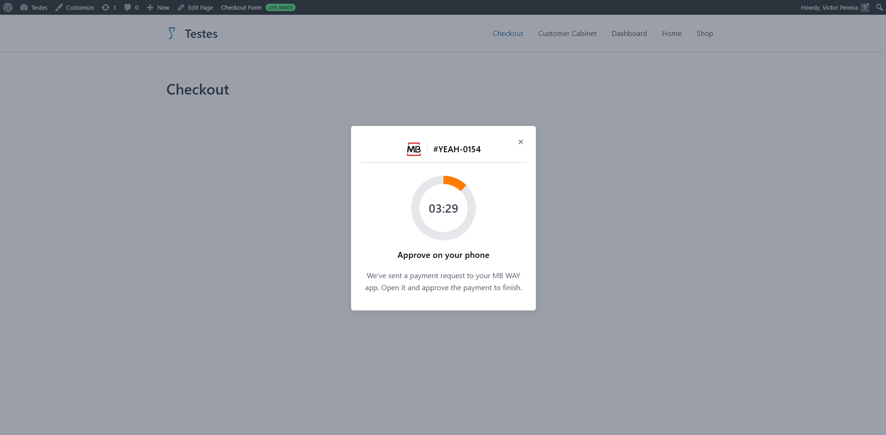
15. **(Customers Experience) Multibanco — payment details (Entity/Reference)**
    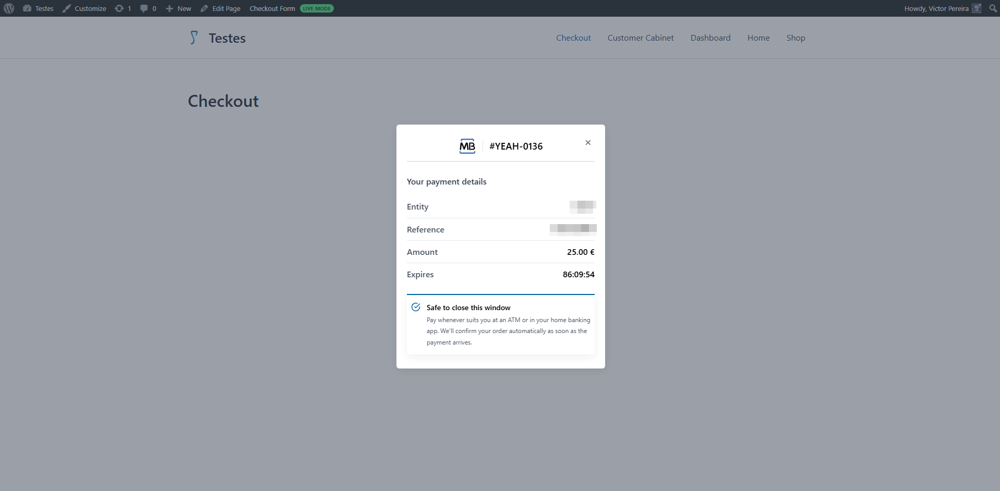
16. **(Customers Experience) Payment confirmation — Thank you**
    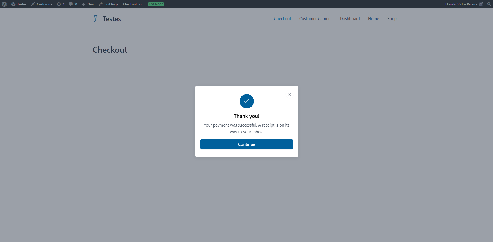
17. **(Admin Only) ifthenpay Orders — payment entries log**
    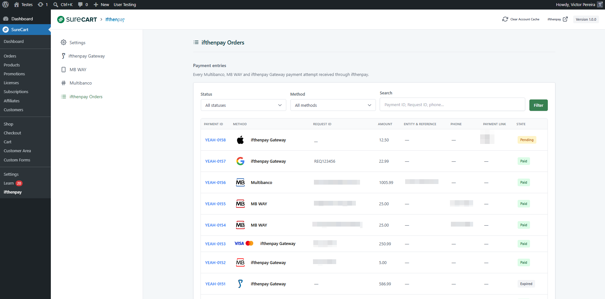
18. **(Customers Experience) Customer Area — order history**
    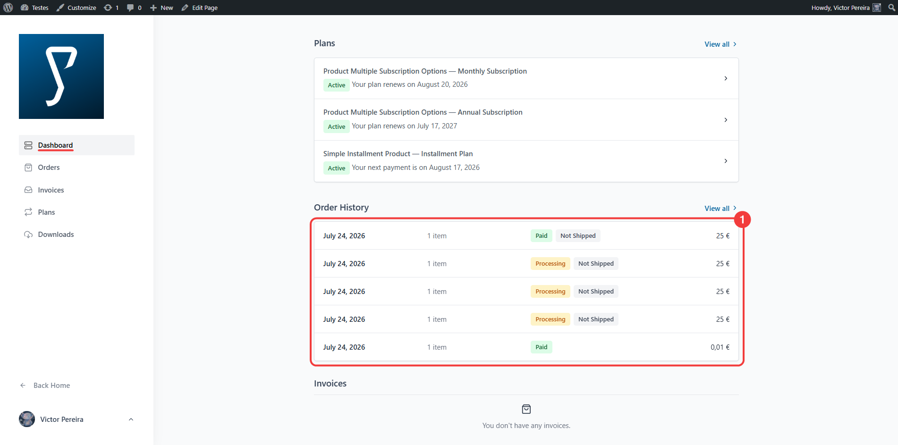
19. **(Customers Experience) Single order page — "ifthenpay Payment Details" block (MB WAY paid)**
    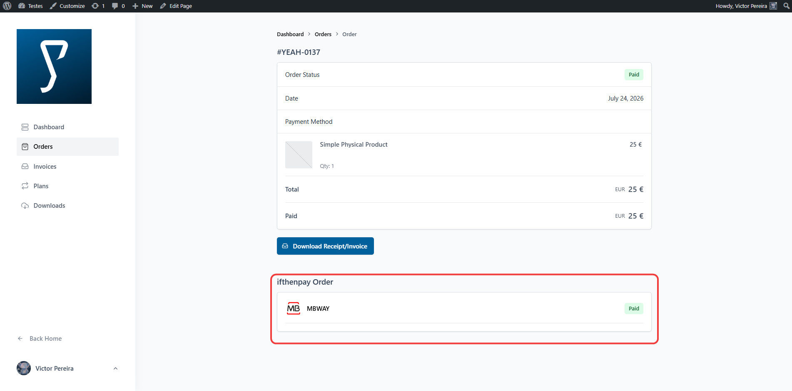
20. **(Customers Experience) Single order page — "ifthenpay Payment Details" block (Multibanco pending)**
    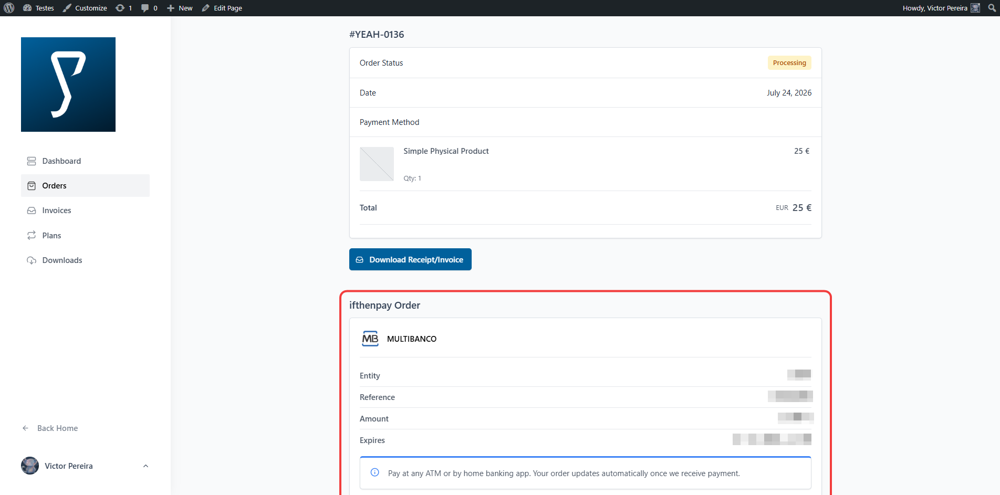

## Support

For assistance use the [WordPress.org support forum](https://wordpress.org/support/plugin/ifthenpay-payments-for-surecart):

Pre-checks:

- Backoffice Key connected, and the method you're testing enabled on the Settings tab
- Running current recommended versions of WordPress, PHP, and SureCart

Commercial helpdesk available (no direct email required): [helpdesk.ifthenpay.com](https://helpdesk.ifthenpay.com/)

- **ifthenpay support**: [suporte@ifthenpay.com](mailto:suporte@ifthenpay.com)
- **SureCart docs**: [SureCart docs](https://surecart.com/docs/)
